  

  
  
  

  

---

## Security consultant, toolmaker, and Managing Director at [Aegis Cyber](https://www.aegiscyber.co.uk/)

I help teams find and fix security issues across web applications, blockchain systems, infrastructure, and compliance-heavy environments. My work sits close to real-world attack paths: offensive security, secure design reviews, tooling, and clear reporting that engineering teams can act on.

Outside client work, I build practical security tools used by the community, including [Burp Suite extensions](https://github.com/aress31?tab=repositories&q=burp&type=&language=&sort=stargazers) and [WireSpy](https://github.com/aress31/wirespy), which has been featured by [Pentester Academy](https://www.pentesteracademy.com/).

|                |                                                                                                               |
| -------------- | ------------------------------------------------------------------------------------------------------------- |
| Focus          | Offensive security, blockchain security, pentesting, compliance                                               |
| Experience     | 10+ years across banking, fintech, government, and high-risk systems                                          |
| Certifications | [OSCP, OSWE, CREST, Black Hat trainings, and more](https://www.credential.net/profile/alexandre-teyar/wallet) |
| Company        | [Aegis Cyber](https://www.aegiscyber.co.uk/), UK                                                              |

## Project Highlight

[BurpGPT](https://github.com/aress31/burpgpt) is a Burp Suite extension that brought LLM-assisted passive analysis into web security testing workflows early, before this became a common pattern in offensive tooling. It remains one of my most widely used public projects and reflects how I like to work: applying emerging technology where it creates practical security value.

## What I Work On

| Area                | Work                                                                    |
| ------------------- | ----------------------------------------------------------------------- |
| Offensive security  | Web, API, infrastructure, and cloud-oriented assessments                |
| Blockchain security | Smart contract and protocol review, threat modelling, exploit analysis  |
| Security tooling    | Burp Suite plugins, research utilities, automation, offensive workflows |
| Advisory            | Clear technical guidance for modern teams handling sensitive systems    |

## Certifications

  
  
  
  

Selected certifications. More available in the [credential wallet](https://www.credential.net/profile/alexandre-teyar/wallet).

## Tech I Use

  

Selected from public repositories and day-to-day security work. More available across client work, research, and private tooling.

## GitHub Signal

  

---

  <strong>"The net is vast and infinite."</strong> 
  Ghost in the Shell

